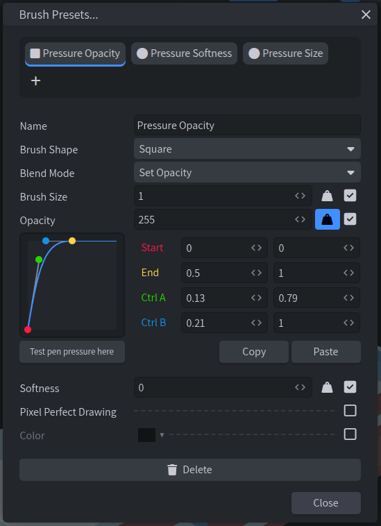

# 🐟 Brush Tuna

A Blockbench plugin that overhauls the Brush Presets system, providing an improved interface, and several new features.

## 💾 Installing

### 🔌 Via Blockbench Plugin Manager

1. Open Blockbench
2. Go to `Edit` > `Plugins`
3. Search for `Brush Tuna` and click `Install`

### 🔗 Via URL

1. Open Blockbench
2. Go to `Edit` > `Plugins` > `Install from URL`
3. Paste the following URL and click `Install`:
    ```
    https://github.com/Embody-Games/Brush-Tuna/releases/latest/download/brush_tuna.js
    ```

## ✨ Features

- Per-preset pen pressure configuration
- Customizable pen pressure curves
- Keybinds for quickly switching between presets using `[` and `]`
- Lock Alpha option can be toggled per Brush Preset
- Improved preset list in Brush Presets menu


